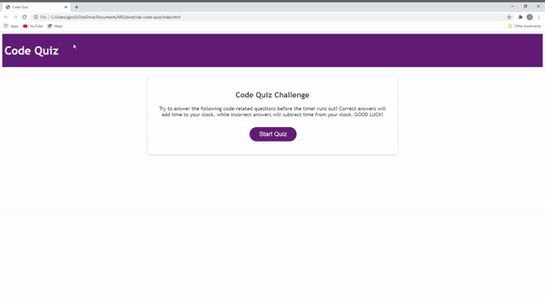

# Code Quiz
This site was developed with the intention of creating a responsive application that will allow the user to take a timed, code-related, multiple choice quiz, have the ability to record their initials/final score, and save their credentials to their local storage. 
## Motivation
The motivation behind this project was to create a timed quiz, in a multiple choice format with provisions added to allow the user to enter their initials and save their high score to a local storage. 
## Tech/Framework Used
Built with Visual Code Studio
## Code Example
Here is an example of how the password generator works:

## Features
* Responsive user interface
* HTML and CSS powered by Javascript
* Multiple choice questions
* Timer
* Local Storage

## Installation
Clone this repository to your machine or download zip file.

## Usage
After the repository has been cloned, click on the index.html and open in browser. 
## License 
> You can reference the full license [here](https://github.com/Picke1id/idp-code-quiz/blob/main/LICENSE).

This project is licensed under the terms of the MIT license.

## Link
* Code Quiz URL: (https://picke1id.github.io/idp-code-quiz/)
